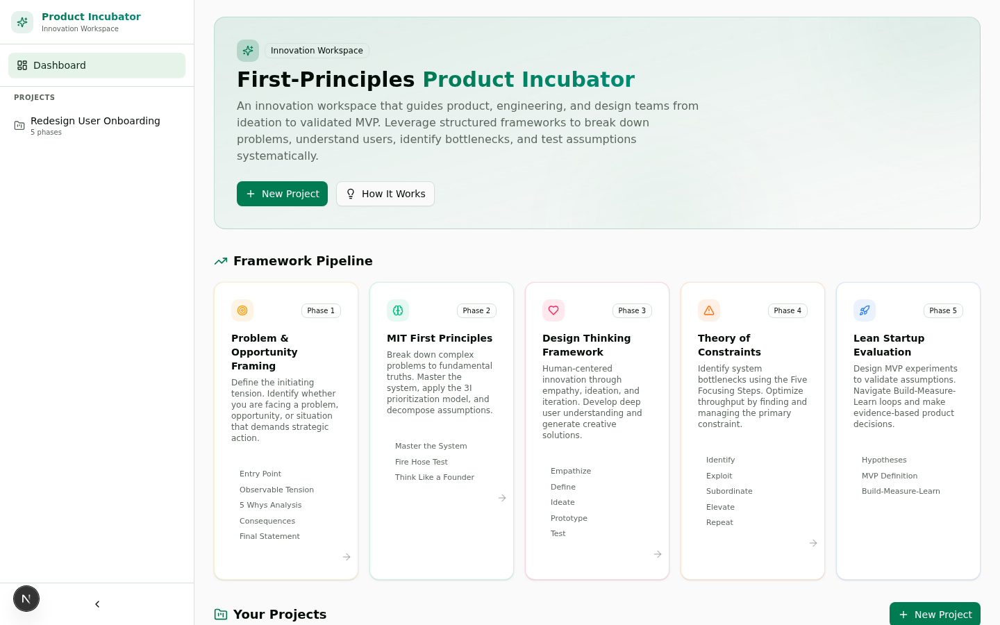
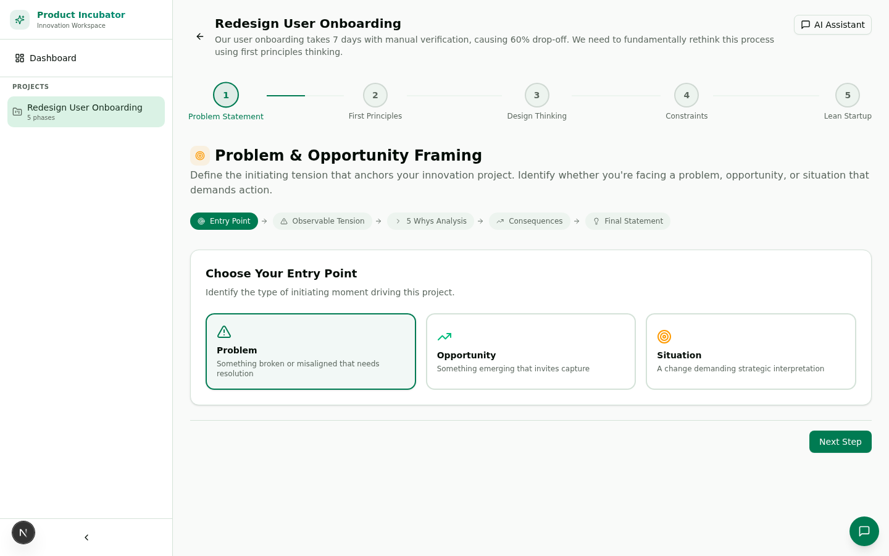
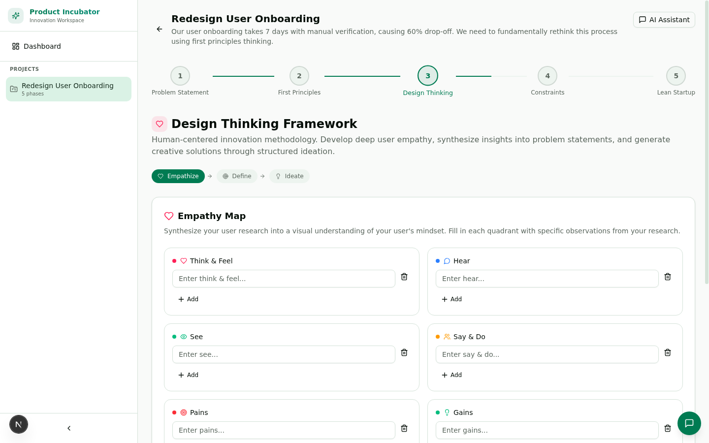
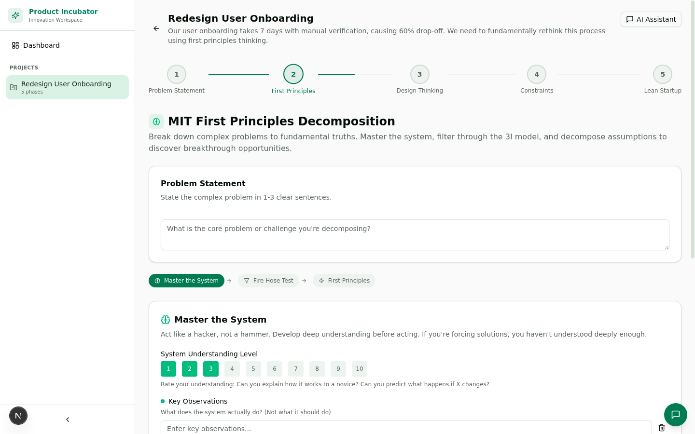
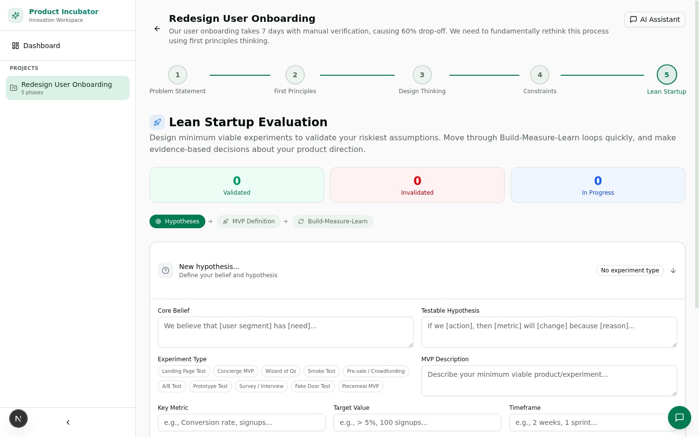

<p align="center">
  <h1>First-Principles Product Incubator</h1>
  <p><strong>An innovation workspace that guides teams from ideation to validated MVP</strong></p>
</p>

<p align="center">
  
</p>

---

## Quick Start

```bash
git clone https://github.com/zan-maker/first-principles-product-incubator.git
cd first-principles-product-incubator
bun install
bun run db:push
bun run dev
```

Open **http://localhost:3000** in your browser. That's it.

---

## What Is This?

The **First-Principles Product Incubator** is a structured web application that helps product, engineering, and design teams systematically move from raw ideas to validated products. It integrates four proven innovation frameworks into a seamless, guided five-phase workflow.

Rather than brainstorming in a vacuum, teams using this workspace decompose problems to fundamental truths, build deep user empathy, identify system bottlenecks, and validate hypotheses with real experiments — all in one integrated tool.

<p align="center">
  
</p>

---

## The Five-Phase Workflow

Every innovation project moves through five sequential phases. Each phase has its own interactive workspace with structured inputs, real-time auto-save, and an AI analysis assistant.

### Phase 1 — Problem & Opportunity Framing

Define the initiating tension that anchors your project. Classify it as a **Problem**, **Opportunity**, or **Situation**, then systematically dig into root causes.

**What you'll do:**
- Classify your entry point (Problem / Opportunity / Situation)
- Document observable tension with specific evidence
- Run a 5 Whys root cause analysis
- Map consequences across strategic, cultural, and financial dimensions
- Auto-generate a compelling problem statement

<p align="center">
  
</p>

### Phase 2 — MIT First Principles Decomposition

Break complex problems down to fundamental truths using three interconnected principles from MIT's engineering culture.

**What you'll do:**
- **Master the System** — Rate your understanding, log observations, map relationships, capture non-obvious insights
- **Fire Hose Test** — Apply the 3I prioritization model (Important, Impactful, Irreversible) to every competing initiative
- **Think Like a Founder** — Separate Facts from Assumptions, identify the highest-leverage assumption, design a test

<p align="center">
  
</p>

### Phase 3 — Design Thinking Framework

Build deep user empathy and generate creative solutions through human-centered design methodology.

**What you'll do:**
- **Empathize** — Complete a full empathy map (Think/Feel, Hear, See, Say/Do, Pains, Gains) with persona development
- **Define** — Craft Point of View (POV) statements and generate How Might We (HMW) opportunity questions
- **Ideate** — Run a Crazy 8s rapid ideation session to generate 8+ ideas in 8 minutes

<p align="center">
  
</p>

### Phase 4 — Theory of Constraints

Identify the primary bottleneck in your system and optimize throughput using Eliyahu Goldratt's Five Focusing Steps.

**What you'll do:**
- **Identify** — Name the constraint, provide evidence, and map undesirable effects using a Current Reality Tree
- **Exploit** — Maximize the constraint's output without additional investment
- **Subordinate** — Align all other resources to support the constraint
- **Elevate** — Invest to break the constraint; use the Evaporating Cloud technique for conflict resolution
- **Repeat** — Find the next constraint and continue the improvement cycle

<p align="center">
  
</p>

### Phase 5 — Lean Startup Evaluation

Design minimum viable experiments to validate your riskiest assumptions and make evidence-based product decisions.

**What you'll do:**
- Manage hypotheses with testable statements and experiment type selection (10 types: Landing Page, Concierge MVP, Wizard of Oz, etc.)
- Define your MVP with core assumptions, minimum features, success criteria, and distribution channel
- Visualize your Build-Measure-Learn feedback loop
- Track validation status per hypothesis (Validated / Invalidated / Inconclusive)

<p align="center">
  
</p>

---

## AI-Powered Analysis

Every phase includes an **AI Assistant** panel that provides context-aware analysis. Share your work from any phase and get:

1. Key insights and observations
2. Actionable suggestions (numbered list)
3. Potential risks or blind spots
4. Recommended next steps
5. A thought-provoking question to consider

Click the **AI Assistant** button in the workspace header, or use the floating chat bubble at the bottom-right corner.

---

## Tech Stack

| Layer | Technology |
|-------|-----------|
| Framework | Next.js 16 (App Router) |
| Language | TypeScript 5 |
| UI Components | shadcn/ui + Radix Primitives |
| Styling | Tailwind CSS 4 |
| Database | SQLite + Prisma ORM |
| State Management | Zustand |
| Animations | Framer Motion |
| AI Integration | z-ai-web-dev-sdk |

---

## Project Structure

```
src/
├── app/
│   ├── api/
│   │   ├── projects/              # Project CRUD endpoints
│   │   │   ├── route.ts            # GET all, POST new
│   │   │   └── [id]/
│   │   │       ├── route.ts        # GET, PUT, DELETE project
│   │   │       └── phases/
│   │   │           ├── route.ts    # GET all, POST new phase
│   │   │           └── [phaseId]/
│   │   │               route.ts    # PUT phase data/status
│   │   └── ai/
│   │       └── analyze/route.ts   # AI analysis per framework
│   ├── layout.tsx
│   ├── page.tsx                   # Main SPA entry point
│   └── globals.css
├── components/
│   ├── phases/
│   │   ├── problem-statement-phase.tsx   # Phase 1
│   │   ├── first-principles-phase.tsx    # Phase 2
│   │   ├── design-thinking-phase.tsx     # Phase 3
│   │   ├── toc-phase.tsx                 # Phase 4
│   │   └── lean-startup-phase.tsx        # Phase 5
│   ├── app-sidebar.tsx           # Collapsible sidebar navigation
│   ├── dashboard-view.tsx        # Main dashboard with framework pipeline
│   ├── project-workspace.tsx     # Project workspace with phase stepper
│   ├── phase-stepper.tsx         # Visual progress indicator
│   ├── ai-chat-panel.tsx         # AI assistant chat (expandable)
│   ├── new-project-dialog.tsx    # Project creation dialog
│   └── ui/                       # shadcn/ui component library
├── lib/
│   ├── db.ts                     # Prisma database client
│   ├── store.ts                  # Zustand global state
│   └── utils.ts                  # Utility functions
├── hooks/
│   ├── use-toast.ts
│   └── use-mobile.ts
└── prisma/
    └── schema.prisma              # Database schema
```

---

## Database Schema

Two models power the application:

**Project** — Top-level innovation project
- `id`, `name`, `description`, `status`, `createdAt`, `updatedAt`

**ProjectPhase** — Individual framework phase with JSON data
- `id`, `projectId`, `phase` (enum), `status` (not_started/in_progress/completed), `data` (JSON), `createdAt`, `updatedAt`

---

## API Endpoints

| Method | Endpoint | Description |
|--------|----------|-------------|
| GET | `/api/projects` | List all projects with phases |
| POST | `/api/projects` | Create a new project |
| GET | `/api/projects/[id]` | Get a single project |
| PUT | `/api/projects/[id]` | Update project name/description/status |
| DELETE | `/api/projects/[id]` | Delete a project |
| GET | `/api/projects/[id]/phases` | List all phases for a project |
| POST | `/api/projects/[id]/phases` | Create a new phase |
| PUT | `/api/projects/[id]/phases/[phaseId]` | Update phase data and status |
| POST | `/api/ai/analyze` | Get AI analysis for a framework phase |

---

## Usage Guide

### Creating Your First Project

1. Click **New Project** on the dashboard
2. Give it a descriptive name (e.g., "Redesign User Onboarding Flow")
3. Describe the problem or opportunity you're tackling
4. Click **Create Project**

### Working Through the Phases

The phase stepper at the top of the workspace shows your progress. Click any phase number to jump directly to it. Each phase auto-saves as you work — no manual save required.

**Recommended flow:**
1. Start with **Problem Framing** to establish a clear, evidence-based foundation
2. Move to **First Principles** to decompose the problem and prioritize ruthlessly
3. Use **Design Thinking** to build empathy and generate creative solutions
4. Apply **Theory of Constraints** to identify and address system bottlenecks
5. Finish with **Lean Startup** to validate your approach through experiments

### Using the AI Assistant

- Click **AI Assistant** in the workspace header or the floating chat bubble
- Paste your work from any phase and ask for analysis
- Try prompts like: "Analyze my approach", "What am I missing?", "Suggest next steps"

---

## Demo Videos

Two AI-generated demo videos are included:

| Video | Description |
|-------|-------------|
| [product-incubator-demo.mp4](docs/videos/product-incubator-demo.mp4) | Dashboard overview and framework pipeline |
| [workspace-demo.mp4](docs/videos/workspace-demo.mp4) | Workspace phase navigation walkthrough |

Screenshots are available in `docs/images/`.

---

## Running in Production

```bash
bun run build
bun run start
```

The production build creates a standalone server in `.next/standalone/`.

---

## Customization

### Adding a New Framework Phase

1. Create a new component in `src/components/phases/`
2. Add the phase to the `PHASES` array in `src/components/project-workspace.tsx`
3. Add the corresponding system prompt in `src/app/api/ai/analyze/route.ts`
4. Add the phase to the database initialization in the workspace `useEffect`

### Modifying the AI Analysis Prompts

Edit the `systemPrompts` object in `src/app/api/ai/analyze/route.ts` to customize the AI's behavior for each framework phase.

### Changing the Theme

The color system uses CSS custom properties defined in `src/app/globals.css`. Modify the `:root` and `.dark` selectors to change the color scheme.

---

## Framework Credits

This application is built on established innovation and strategy methodologies:

- **MIT First Principles** — Originating from MIT's engineering culture, emphasizing deep system understanding, focused prioritization through the 3I Model, and assumption decomposition to fundamental truths
- **Design Thinking** — Based on methodologies from Stanford d.school, IDEO, and Google Ventures Design Sprint, structured around Empathize, Define, Ideate, Prototype, and Test
- **Theory of Constraints** — Developed by Eliyahu M. Goldratt, focused on identifying system bottlenecks through the Five Focusing Steps and optimizing throughput
- **Lean Startup** — Based on Eric Ries's methodology for validated learning, Build-Measure-Learn loops, and rapid experimentation with MVPs

---

## License

MIT License. Use, modify, and distribute freely.
